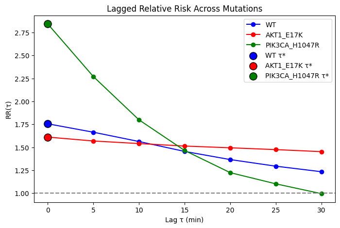

# Spatiotemporal Signal Propagation: WT vs. PIK3CA_H1047R and AKT1_E17K

## Brief Methods Summary
We adapted the methodology from `notebooks-part3/Part2_L1_LaggedExposure.ipynb` to compute the Relative Risk ($RR(\tau)$) across lags of $\tau \in \{0, 1, 2, 3, 4, 5, 6\}$ frames, corresponding to a range of 0 to 30 minutes with 5-minute sampling intervals. Alongside the Wild Type (WT) control, we selected the **PIK3CA_H1047R** and **AKT1_E17K** mutants. This selection is justified by their contrasting baseline spatial coordination at lag 0 in `Part1_Block3_Comparison`, where they exhibited the highest ($RR = 3.2$) and lowest ($RR = 1.58$) Relative Risk of ERK activation, respectively. For each cell line, we identified the optimal lag ($\tau^*$) where $RR(\tau)$ is maximized.

While both mutations modulate ERK via the PI3K/AKT pathway, they operate at opposite regulatory levels. The upstream mutation PIK3CA_H1047R enhances network excitability to drive massive ERK waves, whereas the downstream mutation AKT1_E17K triggers negative feedback loops that promote cell autonomy. Introducing this temporal lag allowed us to directly address our core research question: *Do different mutations exhibit different spatiotemporal relay timescales, and specifically, how does the propagation speed of activation from a neighboring cell to a focal cell change over time?* Ultimately, we are interested in determining whether this contrasting baseline behavior will also manifest as a distinct difference in how the signaling response depends on the timing of the neighbor's activation.

---

## Key Results

### Summary Table
The table below presents the mutation lines, their optimal lag values ($\tau^*$), and the maximum observed Relative Risk ($max\_RR$).

| Mutation | Optimal Lag ($\tau^*$) | Maximum Relative Risk ($max\_RR$) |
| :--- | :---: | :---: |
| **WT** | 0 | 1.7558 |
| **AKT1_E17K** | 0 | 1.6109 |
| **PIK3CA_H1047R** | 0 | 2.8435 |

### Visualization

---

## Interpretation

Our analysis confirms that the PIK3CA_H1047R mutation drastically strengthens the spatiotemporal coordination of ERK. However, this effect is strongly concentrated in time—a rapid drop to a low value (RR=1.0) at 30 minutes suggests that after the passage of an intense activation wave, immediate signal quenching occurs.

In contrast to it, the AKT1_E17K profile is almost flat and stabilizes at a low level. This means the promotion of cell autonomy and disconnection from the dynamic waves of neighbors; the RR remaining above 1 ($\approx 1.5$) for AKT1_E17K indicates that the activation of neighbors still increases the probability of an ERK spike, but this effect does not disappear nor does it create a clear temporal structure, which suggests an elevated global activity rather than proper intercellular signal propagation.

Wild Type (WT) constitutes a physiological control: it shows a clear dependence on time (a gentler slope), but at 30 minutes it does not drop to unity. This proves that natural signaling in WT is more extended in time, while the PIK3CA_H1047R mutation pathologically condenses and shortens the duration of intercellular communication. All lines reach their maximum at $\tau^* = 0$, which indicates that the strongest mechanism of transmission initiation occurs faster than the sampling interval (5 min).