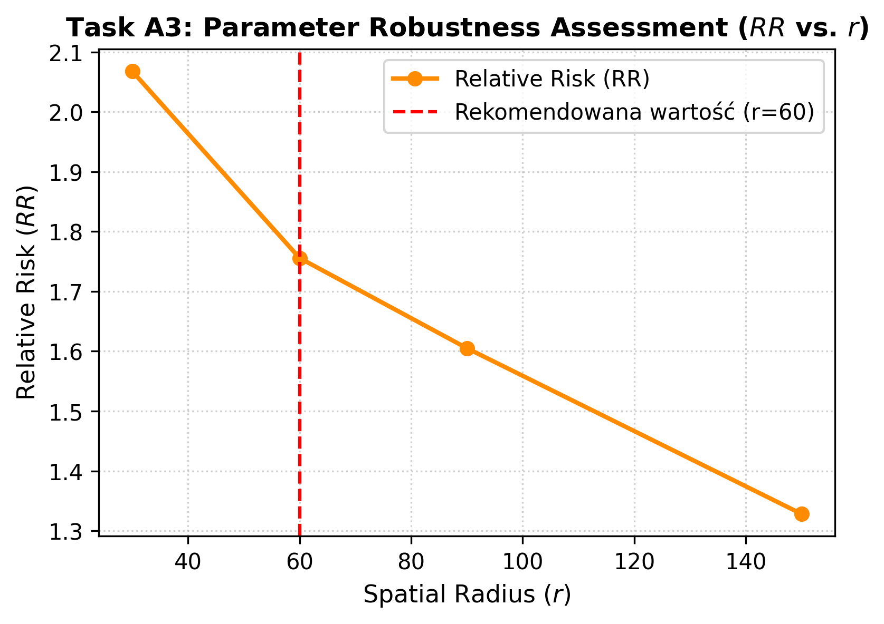

## Task A3: Parameter Robustness Assessment (Varying Spatial Radius $r$)

### Methods Summary
W celu oceny wrażliwości modelu na zmiany parametrów przestrzennych przeprowadzono analizę stabilności metryki ryzyka względnego ($RR$) poprzez modyfikację promienia przestrzennego $r \in \{30, 60, 90, 150\}$, przy jednoczesnym zamrożeniu okna przyszłości ($W = 3$ klatki) oraz kwantyla odcięcia skoków sygnału ($q = 0.90$). Obliczenia zrealizowano przy użyciu skryptu 'spatiotemporal_signal_propagation.py' wywoływanego z poziomu notebooka 'notebooks-part2/Part1_Block2_ParameterSensitivity.ipynb'. Skrypt przetwarzał sekwencyjnie skompresowany plik wejściowy z trajektoriami komórkowymi dla eksperymentu, generując pliki raportów 'summary.json' oraz 'nodes.csv.gz' dla każdego postanowionego promienia w celu weryfikacji skalowania krawędzi przestrzennych $|E_{sp}|$ oraz zmian ryzyka parakrynnego.

### Key Results

### Interpretation & Recommendation
Analiza wrażliwości parametrów wykazała, że RR (Relative Risk) maleje wraz ze wzrostem promienia przestrzennego (spatial radius). Wykres przedstawia,że spadek ten jest stabilny i monotoniczny, co pokazuje, że wyniki analiz nie są spowodowane błędem obliczeniowym. Najwyższe wartości RR obserwowano dla najmniejszych parametrów, jednak mogą one być bardziej podatne na lokalny szum i przypadkowe wahania sygnału ze względu na małą liczbę sąsiadów. Z kolei duże wartości parametru prowadzą do osłabienia efektu poprzez uwzględnianie bardziej odległych i słabiej powiązanych funkcjonalnie komórek. Parametr r=60 stanowi optymalny kompromis, pozwalający na zachowanie wysokiej czułości detekcji szlaku przekazywania sygnału przy jednoczesnym ograniczeniu szumu tła i rozmycia zależności przestrzennych.