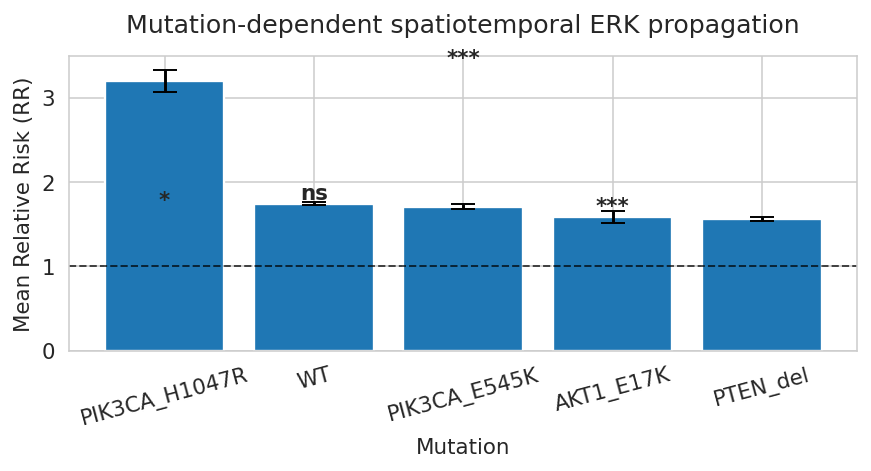
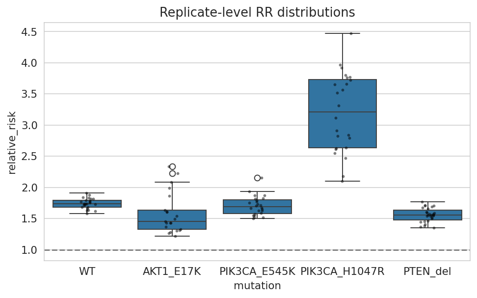

## Statistical interpretation of mutation-dependent propagation strength

To complement the predictive models (Logistic Regression and GNN), we performed
a replicate-level statistical analysis of Relative Risk (RR) across PI3K–AKT
pathway mutations.

This analysis quantifies how oncogenic mutations modulate spatiotemporal ERK
signal propagation between neighboring cells and provides an interpretable
population-level view of signaling coordination strength.

We observed clear mutation-dependent differences in propagation behavior.

The strongest effect was seen in **PIK3CA_H1047R**, which exhibited the highest
mean RR (~3.20), significantly exceeding WT. This indicates a strong enhancement
of ERK signal propagation in this oncogenic background, consistent with
hyperactive PI3K signaling increasing coordination between neighboring cells.

In contrast, **PTEN deletion** and **AKT1_E17K** showed significantly reduced RR
compared to WT, suggesting weaker or less coordinated propagation dynamics in
these conditions.

The **PIK3CA_E545K** mutation did not differ significantly from WT, indicating a
more subtle or context-dependent effect on propagation strength.

Statistical testing using the Mann–Whitney U test with Bonferroni correction
confirmed that several of these differences are significant, particularly for
PIK3CA_H1047R, AKT1_E17K, and PTEN_del, supporting robust mutation-dependent
reprogramming of signaling coordination.

Replicate-level boxplots further revealed differences not only in mean RR but
also in variability, with some mutations (notably PIK3CA_H1047R) showing higher
dispersion, suggesting heterogeneous propagation behavior across experimental
blocks.

Overall, these results demonstrate that oncogenic mutations in the PI3K–AKT
pathway systematically reshape multicellular ERK propagation, both in terms of
strength (mean RR) and stability (variance), providing mechanistic evidence that
signaling coordination is strongly genotype-dependent.

# Spatiotemporal Signal Propagation: WT vs. PIK3CA_H1047R and AKT1_E17K

## Brief Methods Summary
We adapted the methodology from `notebooks-part3/Part2_L1_LaggedExposure.ipynb` to compute the Relative Risk ($RR(\tau)$) across lags of $\tau \in \{0, 1, 2, 3, 4, 5, 6\}$ frames, corresponding to a range of 0 to 30 minutes with 5-minute sampling intervals. Alongside the Wild Type (WT) control, we selected the **PIK3CA_H1047R** and **AKT1_E17K** mutants. This selection is justified by their contrasting baseline spatial coordination at lag 0 in `Part1_Block3_Comparison`, where they exhibited the highest ($RR = 3.2$) and lowest ($RR = 1.58$) Relative Risk of ERK activation, respectively. For each cell line, we identified the optimal lag ($\tau^*$) where $RR(\tau)$ is maximized.

While both mutations modulate ERK via the PI3K/AKT pathway, they operate at opposite regulatory levels. The upstream mutation PIK3CA_H1047R enhances network excitability to drive massive ERK waves, whereas the downstream mutation AKT1_E17K triggers negative feedback loops that promote cell autonomy. Introducing this temporal lag allowed us to directly address our core research question: *Do different mutations exhibit different spatiotemporal relay timescales, and specifically, how does the propagation speed of activation from a neighboring cell to a focal cell change over time?* Ultimately, we are interested in determining whether this contrasting baseline behavior will also manifest as a distinct difference in how the signaling response depends on the timing of the neighbor's activation.

---

## Key Results

### Summary Table
The table below presents the mutation lines, their optimal lag values ($\tau^*$), and the maximum observed Relative Risk ($max\_RR$).

| Mutation | Optimal Lag ($\tau^*$) | Maximum Relative Risk ($max\_RR$) |
| :--- | :---: | :---: |
| **WT** | 0 | 1.7558 |
| **AKT1_E17K** | 0 | 1.6109 |
| **PIK3CA_H1047R** | 0 | 2.8435 |

### Visualization

---

## Interpretation

Our analysis confirms that the PIK3CA_H1047R mutation drastically strengthens the spatiotemporal coordination of ERK. However, this effect is strongly concentrated in time—a rapid drop to a low value (RR=1.0) at 30 minutes suggests that after the passage of an intense activation wave, immediate signal quenching occurs.

In contrast to it, the AKT1_E17K profile is almost flat and stabilizes at a low level. This means the promotion of cell autonomy and disconnection from the dynamic waves of neighbors; the RR remaining above 1 ($\approx 1.5$) for AKT1_E17K indicates that the activation of neighbors still increases the probability of an ERK spike, but this effect does not disappear nor does it create a clear temporal structure, which suggests an elevated global activity rather than proper intercellular signal propagation.

Wild Type (WT) constitutes a physiological control: it shows a clear dependence on time (a gentler slope), but at 30 minutes it does not drop to unity. This proves that natural signaling in WT is more extended in time, while the PIK3CA_H1047R mutation pathologically condenses and shortens the duration of intercellular communication. All lines reach their maximum at $\tau^* = 0$, which indicates that the strongest mechanism of transmission initiation occurs faster than the sampling interval (5 min). 

## Task A3: Parameter Robustness Assessment (Varying Spatial Radius $r$)

### Methods Summary
To evaluate the model's sensitivity to changes in spatial parameters, a stability analysis of the relative risk ($RR$) metric was performed by varying the spatial radius $r \in \{30, 60, 90, 150\}$, while freezing the future window ($W = 3$ frames) and the signal jump threshold quantile ($q = 0.90$). Computations were executed using the `spatiotemporal_signal_propagation.py` script called from the `notebooks-part2/Part1_Block2_ParameterSensitivity.ipynb` notebook. The script sequentially processed the compressed input file containing cellular tracks for the experiment, generating `summary.json` and `nodes.csv.gz` report files for each specified radius to verify the scaling of spatial edges $|E_{sp}|$ and changes in paracrine risk.

### Key Results

### Interpretation & Recommendation
Parameter sensitivity analysis showed that RR (Relative Risk) decreases with an increase in the spatial radius. The plot demonstrates that this decrease is stable and monotonic, indicating that the analysis results are not caused by a computational error. The highest RR values were observed for the smallest parameters; however, they may be more susceptible to local noise and accidental signal fluctuations due to the small number of neighbors. On the other hand, large parameter values lead to a weakening of the effect by including more distant and weakly functionally linked cells. The parameter r=60 represents an optimal compromise, allowing for high sensitivity in detecting the signal transduction pathway while simultaneously limiting background noise and the blurring of spatial dependencies. 

## Independent analysis

Cellular signaling in multicellular systems is not isolated at the single-cell level,
but emerges from coordinated spatiotemporal interactions between neighboring cells.

In this analysis, we ask:

> How does the local spatiotemporal neighborhood structure of cells determine future
signaling propagation, and how is this predictive relationship modulated by oncogenic
PI3K–AKT pathway mutations?

To address this question, we compare three complementary levels of analysis:

1. **Classical predictive modeling (Logistic Regression)**  
   Integrates engineered graph-derived features to predict future signaling events.

2. **Graph-based deep learning (Graph Neural Networks)**  
   Learns propagation rules directly from spatiotemporal graph structure without
   relying on manually engineered features.

We hypothesize that:
- Logistic regression captures mainly local, engineered summaries of signaling activity
- Graph Neural Networks can learn nonlinear, higher-order and mutation-dependent
  propagation dynamics directly from the underlying cellular interaction network

This framework allows us to move from descriptive statistics toward predictive and
mechanistic modeling of multicellular signaling behavior.

---

## Final GNN Performance Summary

The Graph Neural Network achieved moderate predictive performance for future signaling
jump events, with a ROC-AUC of 0.749, indicating that the model successfully learned
biologically meaningful relationships within the spatiotemporal signaling graph.

The model reached an accuracy of 79.2%; however, because signaling jump events are
relatively rare, accuracy alone is not sufficient to assess model quality. More
informative metrics are recall and F1-score.

The recall of 54.2% indicates that the model was able to identify more than half of all
future signaling jump events, demonstrating substantial sensitivity to propagation
dynamics. Precision remained lower (24.6%), suggesting that the increased sensitivity
came at the cost of additional false-positive predictions.

The F1-score of 0.339 reflects a balanced compromise between precision and recall under
strong class imbalance conditions.

Overall, the results demonstrate that future signaling activity is partially predictable
from local graph structure and neighboring cellular states, supporting the hypothesis
that multicellular signaling propagation exhibits learnable network-level organization.

